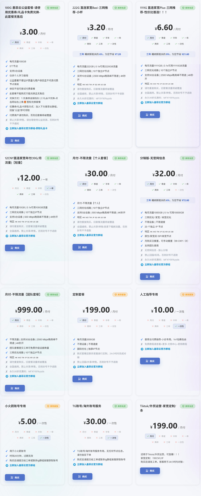
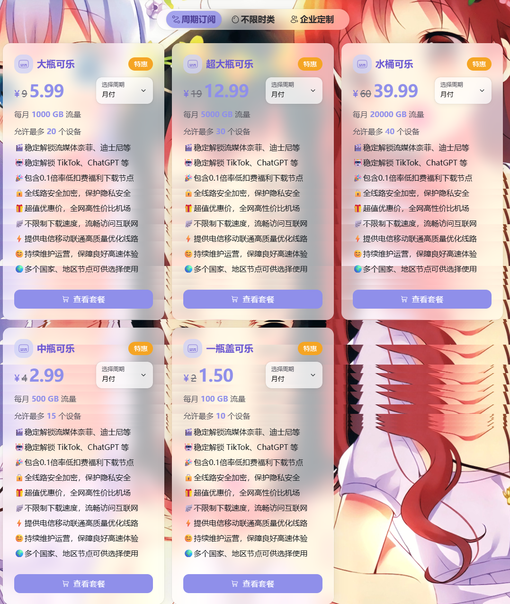
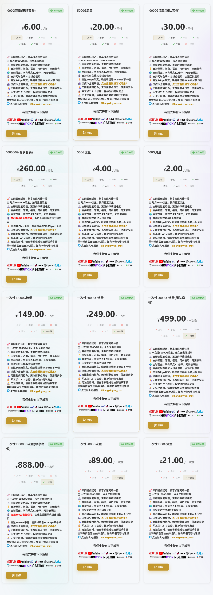
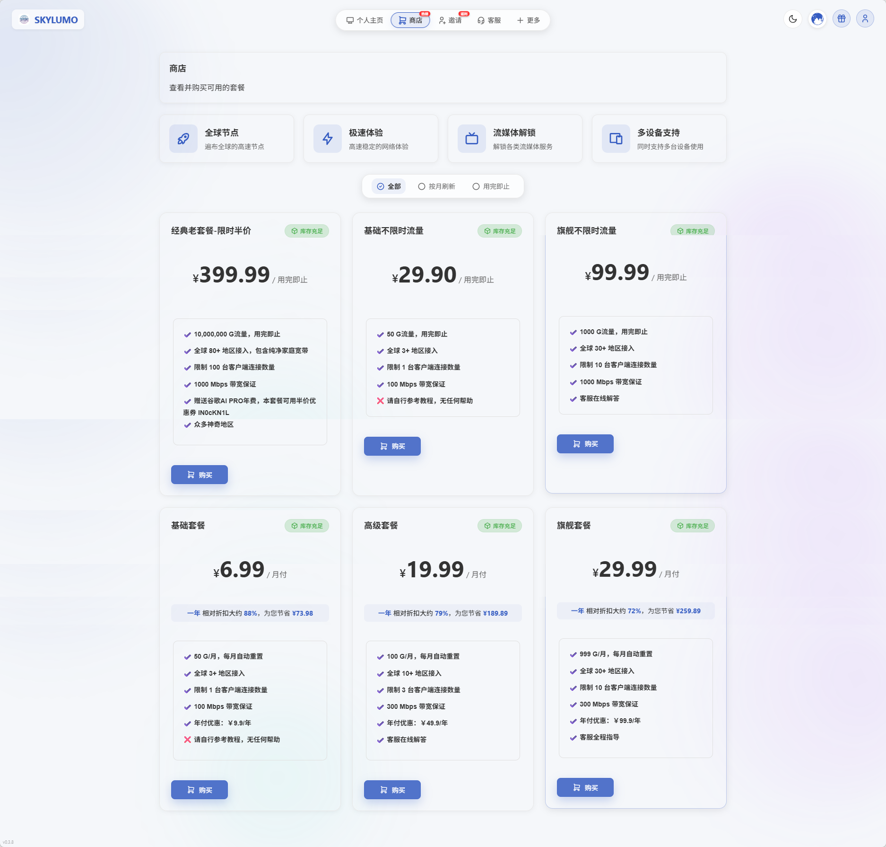
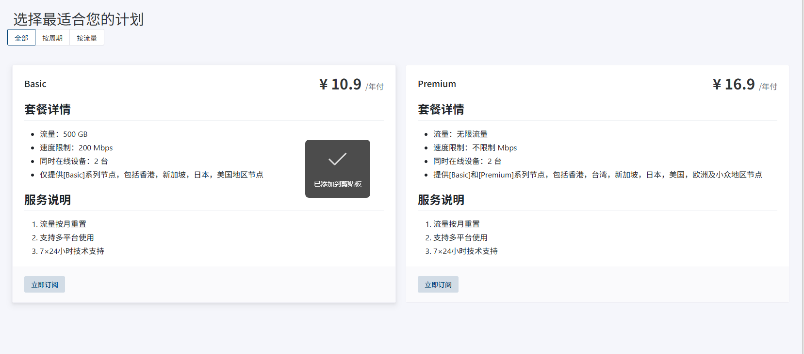
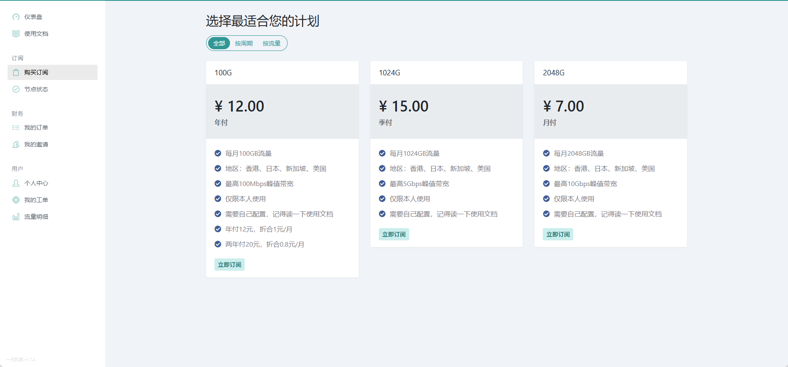

# Free and Low-Cost Proxy Service Index

[中文版](README.md)

This repository collects publicly available information about free or low-cost proxy service providers, including official websites, plan prices, traffic quotas, free trials, node regions, payment methods, and plan screenshots.

## Important Notice

This repository is only for public information aggregation. It does not provide, store, or distribute any of the following:

- Node subscription links;
- Account credentials;
- Invitation code reselling;
- Cracked resources;
- Non-public APIs;
- Step-by-step instructions for bypassing restrictions;
- Any content that violates applicable laws, regulations, or platform rules.

All prices, traffic quotas, node regions, payment methods, and screenshots may change at any time. Please refer to the official public pages of each provider.

## Data Update Time

Last generated on: `2026-06-04`

## Summary Table

| No. | Name | Category | Lowest Price | Traffic | Free Trial | Node Regions | Last Checked | Details |
|---:|---|---|---:|---|---|---|---|---|
| 1 | MoFeiYun | Free public-benefit / Low-cost | Free / Trial | 100GB/month (public-benefit plan, redeemable for free with coupon/gift card) | Yes. The public-benefit plan can be redeemed for free; screenshot price is CNY 3/month. | Hong Kong, Macau, Taiwan, Japan, Singapore, South Korea, United States, United Kingdom | 2026-06-04 | [View](#mofeiyun) |
| 2 | PeiQian Airport | Low-cost / One-time traffic | CNY 1.5/month | 100GB/month (lowest recurring plan); one-time traffic packages start from 1000GB. | Not disclosed | Multiple countries, Multiple regions | 2026-06-04 | [View](#peiqian-airport) |
| 3 | LiangXinYun | Low-cost | CNY 2/month | 100GB/month (lowest plan); other plans include 500GB, 1000GB, 5000GB, and 10000GB. | Not disclosed | Global coverage, Xinjiang, Henan, Fujian | 2026-06-04 | [View](#liangxinyun) |
| 4 | SKYLUMO | Low-cost / One-time traffic | CNY 9.9/year | 50GB/month (Basic yearly promo CNY 9.9/year); also offers 50GB one-time traffic for CNY 29.90. | Not disclosed | Global 3+ regions, Global 10+ regions, Global 30+ regions | 2026-06-04 | [View](#skylumo) |
| 5 | JiaoJuZhe | Low-cost | CNY 10.9/year | 500GB/month (Basic); Premium offers unlimited traffic. | Not disclosed | Hong Kong, Taiwan, Singapore, Japan, United States, Europe, Less-common regions | 2026-06-04 | [View](#jiaojuzhe) |
| 6 | 1 Yuan Airport | Low-cost | CNY 12/year | 100GB/month (CNY 12/year, about CNY 1/month); also offers 1024GB/quarter and 2048GB/month plans. | Not disclosed | Hong Kong, Japan, Singapore, United States | 2026-06-04 | [View](#one-yuan-airport) |

---

# Provider Details

## 1. MoFeiYun

| Field | Value |
|---|---|
| Category | Free public-benefit / Low-cost |
| Website | [Official Website](https://my.mofeiyun.com/#/register?code=iUjzJTPx) |
| Lowest Price | Free / Trial |
| Traffic | 100GB/month (public-benefit plan, redeemable for free with coupon/gift card) |
| Free Trial | Yes. The public-benefit plan can be redeemed for free; screenshot price is CNY 3/month. |
| Protocols | Not disclosed |
| Node Regions | Hong Kong, Macau, Taiwan, Japan, Singapore, South Korea, United States, United Kingdom |
| Payment Methods | Not disclosed |
| Speed Limit | Not disclosed |
| Device Limit | 3 devices (public-benefit plan) |
| Registration | Open registration |
| Last Checked | 2026-06-04 |

**Plan screenshot:**

[Back to top](#top)

---

## 2. PeiQian Airport

| Field | Value |
|---|---|
| Category | Low-cost / One-time traffic |
| Website | [Official Website](https://xn--mes358aby2apfg.com/register?code=0Yc7HWhn&cover=sfw) |
| Lowest Price | CNY 1.5/month |
| Traffic | 100GB/month (lowest recurring plan); one-time traffic packages start from 1000GB. |
| Free Trial | Not disclosed |
| Protocols | Not disclosed |
| Node Regions | Multiple countries, Multiple regions |
| Payment Methods | Not disclosed |
| Speed Limit | No speed limit |
| Device Limit | Lowest plan supports up to 10 devices; higher plans support up to 40 devices. |
| Registration | Open registration |
| Last Checked | 2026-06-04 |

**Plan screenshot:**

[Back to top](#top)

---

## 3. LiangXinYun

| Field | Value |
|---|---|
| Category | Low-cost |
| Website | [Official Website](https://xn--9kqz23b19z.com/#/register?code=p43sBmQh) |
| Lowest Price | CNY 2/month |
| Traffic | 100GB/month (lowest plan); other plans include 500GB, 1000GB, 5000GB, and 10000GB. |
| Free Trial | Not disclosed |
| Protocols | Not disclosed |
| Node Regions | Global coverage, Xinjiang, Henan, Fujian |
| Payment Methods | Not disclosed |
| Speed Limit | Lowest plan up to 1Gbps; higher plans up to 10Gbps. |
| Device Limit | Lowest plan supports 8 devices; higher plans support up to 50 devices. |
| Registration | Open registration |
| Last Checked | 2026-06-04 |

**Plan screenshot:**

[Back to top](#top)

---

## 4. SKYLUMO

| Field | Value |
|---|---|
| Category | Low-cost / One-time traffic |
| Website | [Official Website](http://163.192.42.74/#/register?code=vhLB5TJb) |
| Lowest Price | CNY 9.9/year |
| Traffic | 50GB/month (Basic yearly promo CNY 9.9/year); also offers 50GB one-time traffic for CNY 29.90. |
| Free Trial | Not disclosed |
| Protocols | Not disclosed |
| Node Regions | Global 3+ regions, Global 10+ regions, Global 30+ regions |
| Payment Methods | Not disclosed |
| Speed Limit | Basic plan 100Mbps; Advanced/Flagship plans 300Mbps; higher one-time plans 1000Mbps. |
| Device Limit | Basic plan 1 client; Advanced plan 3 clients; Flagship plan 10 clients. |
| Registration | Open registration |
| Last Checked | 2026-06-04 |

**Plan screenshot:**

[Back to top](#top)

---

## 5. JiaoJuZhe

| Field | Value |
|---|---|
| Category | Low-cost |
| Website | [Official Website](https://xn--rgt72p76d.com/#/register?code=A1SkpJeZ) |
| Lowest Price | CNY 10.9/year |
| Traffic | 500GB/month (Basic); Premium offers unlimited traffic. |
| Free Trial | Not disclosed |
| Protocols | Not disclosed |
| Node Regions | Hong Kong, Taiwan, Singapore, Japan, United States, Europe, Less-common regions |
| Payment Methods | Not disclosed |
| Speed Limit | Basic 200Mbps; Premium has no speed limit. |
| Device Limit | 2 devices |
| Registration | Open registration |
| Last Checked | 2026-06-04 |

**Plan screenshot:**

[Back to top](#top)

---

## 6. 1 Yuan Airport

| Field | Value |
|---|---|
| Category | Low-cost |
| Website | [Official Website](https://xn--1-q07a56pdss.com/#/register?code=OXQQ8PXd) |
| Lowest Price | CNY 12/year |
| Traffic | 100GB/month (CNY 12/year, about CNY 1/month); also offers 1024GB/quarter and 2048GB/month plans. |
| Free Trial | Not disclosed |
| Protocols | Not disclosed |
| Node Regions | Hong Kong, Japan, Singapore, United States |
| Payment Methods | Not disclosed |
| Speed Limit | Lowest plan up to 100Mbps; higher plans up to 10Gbps. |
| Device Limit | Personal use only |
| Registration | Open registration |
| Last Checked | 2026-06-04 |

**Plan screenshot:**

[Back to top](#top)

---

# Field Description

| Field | Description |
|---|---|
| Name | Provider name |
| Category | Free trial, low-cost plan, long-term plan, etc. |
| Website | Public official website |
| Lowest Price | The lowest publicly visible plan price |
| Traffic | Traffic quota of the plan |
| Free Trial | Whether a free trial is available |
| Protocols | Protocol types publicly displayed by the provider |
| Node Regions | Publicly displayed node regions |
| Payment Methods | Publicly displayed payment methods |
| Speed Limit | Whether speed limit information is disclosed |
| Device Limit | Whether simultaneous device limits are disclosed |
| Registration | Whether registration is open |
| Last Checked | Last manual verification date |
| Plan Screenshot | Screenshot of the public plan page, with private information redacted |

# Disclaimer

This repository is only for public information aggregation and price comparison. It does not constitute purchasing advice, usage advice, or any security guarantee. Service availability, prices, protocols, node regions, and payment methods may change at any time. Please refer to the official public information of each provider.
